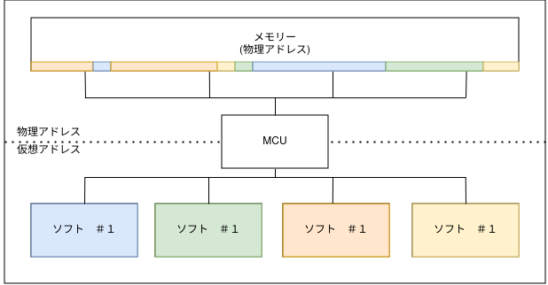
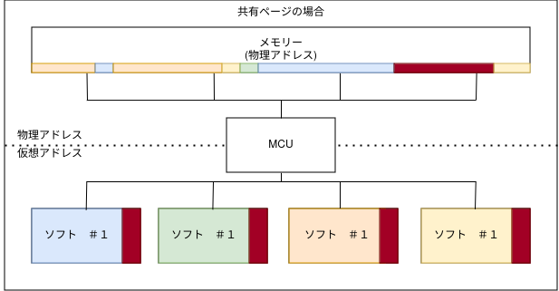

# Linux V6.11 System V Shared pages test

このプロジェクトは、MCUの共有ページのテストです。目的は、9つのプロセス間で行われる行列の乗算を実行し、これらのプロセスが同じメモリ空間で作業することです。このメモリ空間は、別のプロセスによって事前に作成されます。計算プロセスはそれぞれ、親プロセスに信号を送信します。この信号はカウンターをインクリメントし、カウンターが9に達すると計算が完了したことを示します。計算プロセスには、結果行列の特定のセルを処理するための整数がパラメータとして渡されます。

## 重要なシステムコール

このプロジェクトで使用される重要なシステムコールは以下の通りです：

- `shmget` (0x1D): 共有メモリセグメントの識別子を取得します。
- `shmat` (0x1E): 共有メモリセグメントをプロセスのアドレス空間にアタッチします。
- `shmctl` (0x1F): 共有メモリセグメントに対する操作を行います。
- `shmdt` (0x43): 共有メモリセグメントをプロセスのアドレス空間からデタッチします。

## MCUの正常な動作



この画像は、異なるプロセスのメモリアドレスの翻訳に関するMCUの正常な動作を説明しています。MCU（Microcontroller Unit）は、複数のプロセスが同時に実行される環境でのメモリ管理を行います。各プロセスは独自のアドレス空間を持っており、MCUはこれらのアドレスを物理メモリにマッピングします。このプロセスが適切に機能することで、プロセス間の干渉を防ぎ、データ整合性を保つことができます。

## 共有ページを管理するMCUの違い



この画像は、MCUが共有ページを管理する際の違いを説明しています。共有メモリを使用することで、複数のプロセスが同じメモリ空間にアクセスできます。これにより、データの共有と通信が効率的に行えます。MCUは、これらの共有ページを管理し、各プロセスが適切なデータにアクセスできるようにします。具体的には、プロセスは特定のアドレスに対して操作を行い、その結果を他のプロセスと共有します。

## プロジェクトの起動

このプロジェクトは、以下のコマンドで起動できます：

```
make 実行
```

このコマンドは、プログラムをコンパイルし、計算プロセスを実行します。各計算プロセスには、結果行列の特定のセルを処理するための整数が引数として渡されます。これにより、プロセスは自分が担当する計算を特定できるようになります。

## テストプロトコル

プロジェクトでは、9つのプロセスがそれぞれ異なる行列のセルを担当します。各プロセスは、事前に定義されたメモリ空間にアクセスし、自身の担当する行列の要素を計算します。計算が完了すると、プロセスは親プロセスに信号を送り、カウンターがインクリメントされます。すべてのプロセスが計算を終えると、カウンターが9に達し、全体の計算が完了します。

## 使用するシステムコールの詳細

1. **`shmget` (0x1D)**: 共有メモリセグメントを作成または取得するために使用します。プロジェクトの開始時に呼び出され、他のプロセスがアクセスできるようにメモリを確保します。
2. **`shmat` (0x1E)**: 取得した共有メモリセグメントをプロセスのアドレス空間にアタッチします。これにより、プロセスは共有メモリにアクセスできるようになります。
3. **`shmctl` (0x1F)**: 共有メモリセグメントに対してさまざまな制御操作を行います。セグメントの状態を確認したり、削除する際に使用します。
4. **`shmdt` (0x43)**: プロセスが使用している共有メモリセグメントをデタッチします。計算が完了した後、プロセスはこの呼び出しを行い、メモリの解放を行います。

## カーネル設定

このプロジェクトを実行するには、カーネルの設定で`SYSVIPC`オプションが有効である必要があります。これにより、System VのIPC（Inter-Process Communication）機能が使用可能になります。カーネルの設定を確認し、必要に応じて再構築してください。

## まとめ

このプロジェクトは、System V共有メモリを使用して、プロセス間での効率的なデータ共有を実現するためのものです。MCUの動作と、共有メモリを用いた行列乗算の実装に関心がある方にとって、有益なリソースとなることを願っています。
